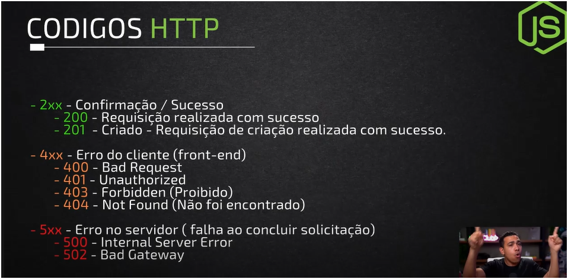
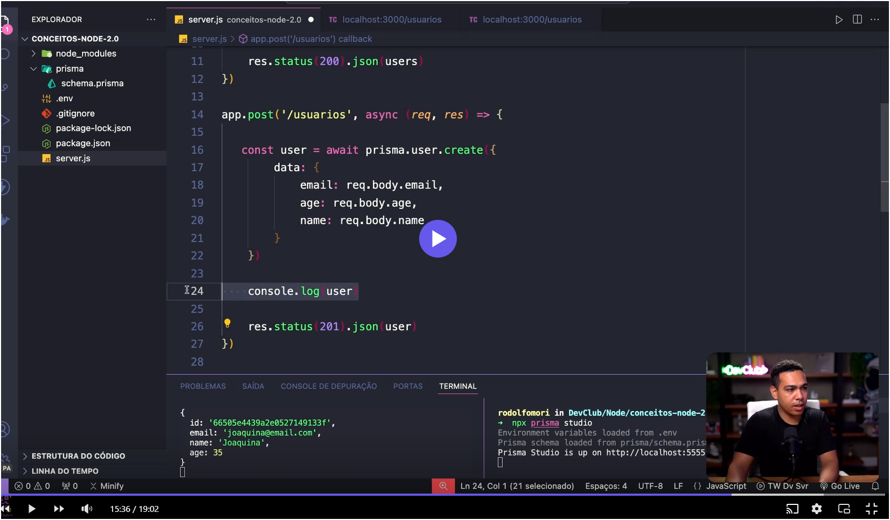
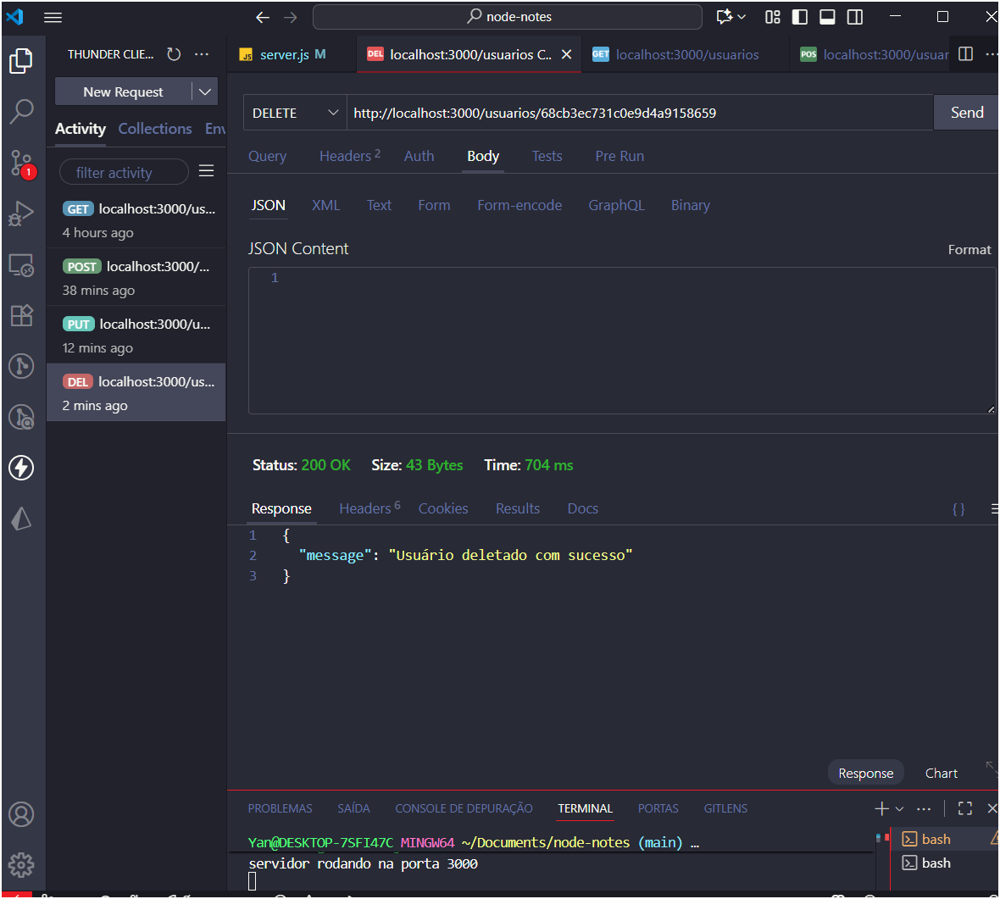

# BACK END NOTES 
repo para anotações e práticas de back-end 

Resumo da comunicação Front & BackEnd  de um projeto 

Instalando o express

Iniciando um servidor 

Códigos HTTPS DE RESPOSTAS DO FRONT END E BACK END 

tomar muito cuidado quando usar route params e query params com a sintaxe.  

LEMBRAR DE LER AS DOCUMENTAÇÕES PARA TER PISTAS DE COMO RESOLVER ESSES PROBLEMAS 

os comandos http get, post e afins acabam se relacionando para de fato manusear dados, entao é importante lembrar esssa relaçao ao trabalhar com o back end de uma aplicação

banco de dados mongodb -> ajuda a criar rapidamente e mais eficentemente.
prisma.io -> biblioteca para facilitar essa comunição e serviço do mongoDB
há dados que envolvem essas ferramentas e tecnologias que serão necessárias apenas durante o desenvolvimento, quando prontos, nem todos os arquivos precisam ir junto. ( isso é relacionado ao devdependencies)

como puxar nossas informações no banco de dados 

um terminal pro server.js outro pro prisma studio 

await ( funções assincronas ) = promisse (quando o servidor retornar uma resposta faça a continuação )

uma boa prática 

- Salvar usuário no banco → Persistir dados no arquivo. 
foi basicamente montar o esqueleto de uma API REST simples usando Express e Prisma para manipular dados de usuários no banco.
🔹 1. Configuração inicial
import express from 'express'
import { PrismaClient } from '@prisma/client'
const prisma = new PrismaClient()
const app = express()
app.use(express.json())

- Importou o Express e o Prisma Client.
- Instanciou o Prisma (prisma) para poder fazer consultas no banco.
- Configurou o Express para entender JSON no corpo das requisições.

🔹 2. Rota GET /usuarios
app.get('/usuarios', async (req, res) => {
    const users = await prisma.user.findMany()
    res.status(200).json(users)
})

- Busca todos os registros da tabela User no banco (findMany()).
- Retorna a lista em formato JSON com status 200 OK.

🔹 3. Rota POST /usuarios
app.post('/usuarios', async (req, res) => {
    const user = await prisma.user.create({
        data: {
            email: req.body.email,
            age: req.body.age,
            name: req.body.name
        }
    })
    res.status(201).json({ message: "Usuário criado com sucesso" })
})


- Cria um novo registro na tabela User usando os dados enviados no corpo da requisição.
- Retorna status 201 Created com uma mensagem de sucesso.

🔹 4. Inicialização do servidor
app.listen(3000, () => {
    console.log('servidor rodando na porta 3000')
})

- Coloca o servidor para ouvir na porta 3000.

📌 Resumo:
Você já tem um mini CRUD começando a tomar forma — já consegue listar e criar usuários no banco via Prisma.

