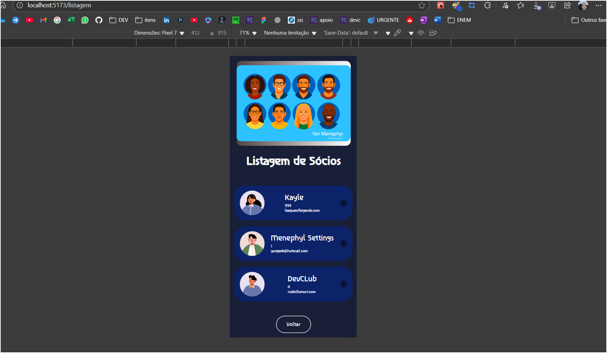

# BACK END NOTES 

repo para anotações e práticas de back-end 

Resumo da comunicação Front & BackEnd  de um projeto 

Instalando o express

Iniciando um servidor 

Códigos HTTPS DE RESPOSTAS DO FRONT END E BACK END 

tomar muito cuidado quando usar route params e query params com a sintaxe.  

LEMBRAR DE LER AS DOCUMENTAÇÕES PARA TER PISTAS DE COMO RESOLVER ESSES PROBLEMAS 

os comandos http get, post e afins acabam se relacionando para de fato manusear dados, entao é importante lembrar esssa relaçao ao trabalhar com o back end de uma aplicação

banco de dados mongodb -> ajuda a criar rapidamente e mais eficentemente.
prisma.io -> biblioteca para facilitar essa comunição e serviço do mongoDB
há dados que envolvem essas ferramentas e tecnologias que serão necessárias apenas durante o desenvolvimento, quando prontos, nem todos os arquivos precisam ir junto. ( isso é relacionado ao devdependencies)

como puxar nossas informações no banco de dados 

⚙️ Back-end
Configuração do MongoDB Atlas
Crie um cluster no MongoDB Atlas (por exemplo, chamado project-0).

Em Network Access, adicione seu IP público (ou 0.0.0.0/0 durante o desenvolvimento) para liberar a conexão.

No Atlas, copie a connection string (algo como mongodb+srv://<usuário>:<senha>@cluster0.mongodb.net/project-0?retryWrites=true&w=majority).

Crie um arquivo .env na raiz de node-notes com:

Código
DATABASE_URL="mongodb+srv://<usuário>:<senha>@cluster0.mongodb.net/project-0?retryWrites=true&w=majority"
O mini-CRUD do back-end persistirá e recuperará todos os registros de usuários diretamente neste banco project-0.

Instalação e configuração
Clone o repositório

Acesse a pasta do back-end

bash
cd node-notes
Instale dependências

bash
npm install
Gere o cliente Prisma e aplique migrações (se houver alterações no schema)

bash
npx prisma migrate dev --name init
npx prisma generate
Endpoints disponíveis
Método	Endpoint	Descrição
GET	/usuarios	Lista todos os usuários
POST	/usuarios	Cria um novo usuário
PUT	/usuarios/:id	Atualiza usuário pelo ID
DELETE	/usuarios/:id	Deleta usuário pelo ID
Executar o servidor
bash
npm run dev
# ou
node --watch server.js
Saída esperada: servidor rodando na porta 3000

Se quiser referências rápidas sobre configurar IP no Atlas ou ajustar TLS, dá um look na documentação oficial do MongoDB Atlas.
um terminal pro server.js outro pro prisma studio 

await ( funções assincronas ) = promisse (quando o servidor retornar uma resposta faça a continuação )

uma boa prática 

- Salvar usuário no banco → Persistir dados no arquivo. 
foi basicamente montar o esqueleto de uma API REST simples usando Express e Prisma para manipular dados de usuários no banco.
🔹 1. Configuração inicial
import express from 'express'
import { PrismaClient } from '@prisma/client'
const prisma = new PrismaClient()
const app = express()
app.use(express.json())

- Importou o Express e o Prisma Client.
- Instanciou o Prisma (prisma) para poder fazer consultas no banco.
- Configurou o Express para entender JSON no corpo das requisições.

🔹 2. Rota GET /usuarios
app.get('/usuarios', async (req, res) => {
    const users = await prisma.user.findMany()
    res.status(200).json(users)
})

- Busca todos os registros da tabela User no banco (findMany()).
- Retorna a lista em formato JSON com status 200 OK.

🔹 3. Rota POST /usuarios
app.post('/usuarios', async (req, res) => {
    const user = await prisma.user.create({
        data: {
            email: req.body.email,
            age: req.body.age,
            name: req.body.name
        }
    })
    res.status(201).json({ message: "Usuário criado com sucesso" })
})


- Cria um novo registro na tabela User usando os dados enviados no corpo da requisição.
- Retorna status 201 Created com uma mensagem de sucesso.

🔹 4. Inicialização do servidor
app.listen(3000, () => {
    console.log('servidor rodando na porta 3000')
})

- Coloca o servidor para ouvir na porta 3000.

📌 Resumo:
Você já tem um mini CRUD começando a tomar forma — já consegue listar e criar usuários no banco via Prisma.

CORS

Projeto: Cadastro de Usuários
Repositório unificado de anotações e práticas para um mini-CRUD completo em Node.js (Express + Prisma) e React (Vite).

📖 Descrição
Este projeto demonstra como criar uma aplicação de cadastro de usuários com:

Back-end em Node.js

Express e CORS para servidor HTTP

Prisma ORM para acesso ao banco de dados

Rotas REST: GET, POST, PUT, DELETE em /usuarios

Front-end em React

Vite como bundler

styled-components para estilos

axios para chamadas à API interna

React Router para navegação SPA

React Hooks (useRef, useState, useEffect)

🚀 Tecnologias
Node.js

Express

Prisma (SQLite ou PostgreSQL)

Cors

React

Vite

styled-components

axios

react-router-dom

⚙️ Back-end
Instalação e configuração
Clone o repositório

Acesse a pasta do back-end

bash
cd node-notes
Instale dependências

bash
npm install
Crie o arquivo .env com sua string de conexão:

Código
DATABASE_URL="file:./dev.db"
Gere o cliente Prisma e aplique migrações:

bash
npx prisma migrate dev --name init
npx prisma generate
Endpoints disponíveis
Método	Endpoint	Descrição
GET	/usuarios	Lista todos os usuários
POST	/usuarios	Cria um novo usuário
PUT	/usuarios/:id	Atualiza usuário pelo ID
DELETE	/usuarios/:id	Deleta usuário pelo ID
Executar o servidor
bash
npm run dev
# ou
node --watch server.js
Saída esperada: Servidor rodando na porta 3000

🎨 Front-end
Instalação
Acesse a pasta do front-end

bash
cd cadastro_usuarios
Instale dependências

bash
npm install
Inicie o servidor de desenvolvimento

bash
npm run dev
Páginas principais
Home (/)

Formulário de cadastro com campos para nome, idade e contato

Usa useRef para capturar valores

Chama POST /usuarios e redireciona para /listagem

Listagem (/listagem)

Busca GET /usuarios para exibir os usuários

Cada card exibe nome, idade, e-mail e ícone de lixeira

Ao clicar no ícone, chama DELETE /usuarios/:id e atualiza a lista

Componentes-chave
TopBackground: banner decorativo no topo

Button: botões estilizados com styled-components

Formulários: uso de useRef e tratamento de eventos

Axios: cliente configurado em /src/services/api.js

React Router: navegação com useNavigate e <Routes>

🗂 Estrutura de Pastas
Código
/
├── node-notes/               # Back-end (Express + Prisma)
│   ├── prisma/
│   │   └── schema.prisma
│   ├── server.js
│   ├── package.json
│   └── .env
└── cadastro_usuarios/        # Front-end (React + Vite)
    ├── public/
    ├── src/
    │   ├── assets/           # Imagens e ícones
    │   ├── components/       # Button, TopBackground, etc.
    │   ├── pages/
    │   │   ├── Home/
    │   │   └── ListUsers/
    │   ├── services/         # Cliente axios
    │   ├── styles/           # Styled-components e temas
    │   └── App.jsx
    ├── package.json
    └── vite.config.js
📸 Screenshots
Fluxo de requisições entre React e Express/Prisma

Servidor rodando e endpoints funcionando

Tela de cadastro de usuários

Listagem com cards e remoção

🤝 Contribuições
Este projeto está aberto a pull requests e issues. Consulte as documentações oficiais de Express, Prisma e Vite para mais detalhes.

📝 Licença
Este projeto está licenciado sob a MIT License. Consulte o arquivo LICENSE para mais informações.